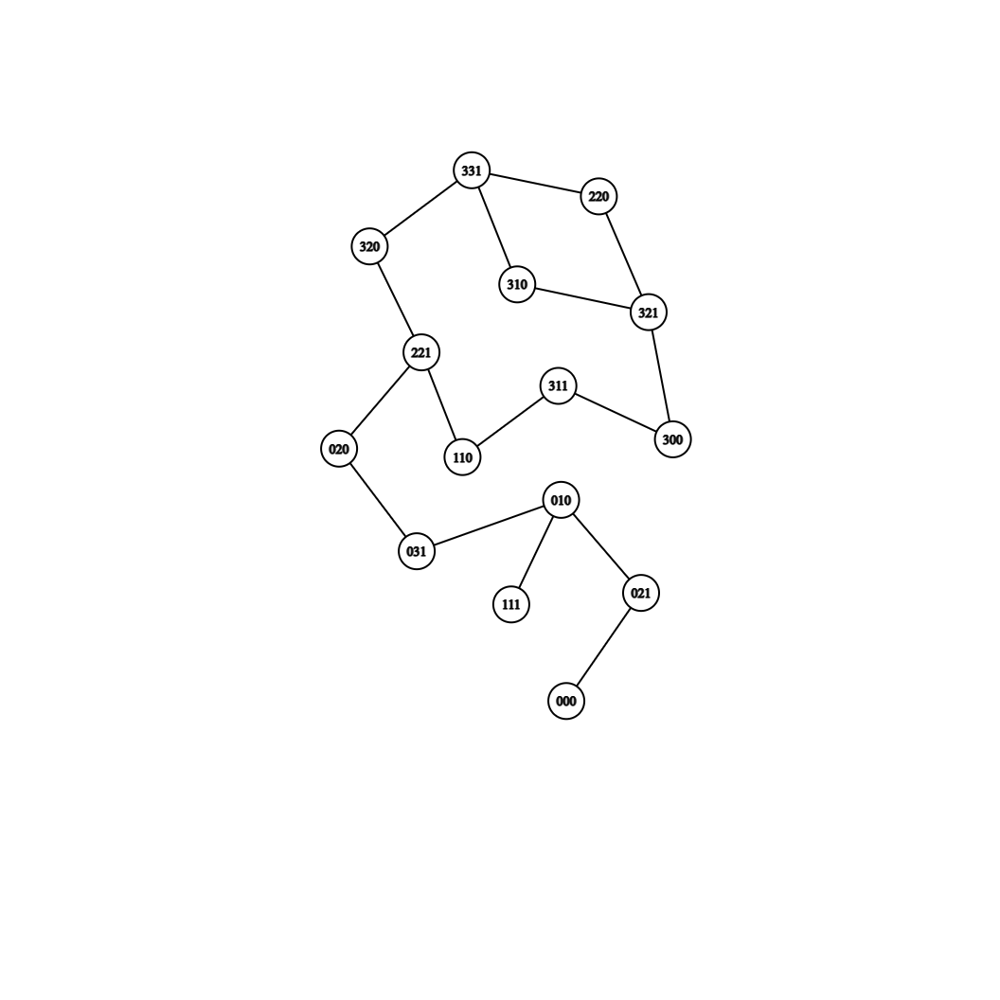

# COSC 76: Artificial Intelligence

## Programming Assignment 1: Uninformed Search.


### Student: Amittai Wekesa (github: @siavava)

### Winter 2021

#### Discussion: The Graph Structure.

In general, given M chickens and N foxes, the resulting Graph will have a total of (M+1) * (N+1) possible states, counting the zero states.

The number of *all* edges from each node will be twice the capacity of the boat (accounting for the combinations of chickens and foxes).

Therefore, the total edges in the Graph will be (M+1) * (N+1) * (2x),  if the capacity of the boat is X. Therefore, the upper bound is O(M*N*x)

I drew a Graph of the entire search tree showing all valid actions for the `3, 3, 1` problem, from the start state to the goal state of `(0, 0, 0)`.



#### Discussion: BFS

I implemented BFS using a deque as a queue of nodes to visit, using `append()` to add new nodes to the end of the dequeue and `popleft()` to extract the node at the front of the queue.

The BFS algorithms also uses a set to track visited states and avoid revisiting states.

```Python
visit_queue = deque()
visit_queue.append(start_node)
while len(visit_queue) > 0:
    # Check the states in the queue.
```

We test each new test to see if the goal state has been found. Once the goal is found, we backtrack to reconstruct the path.

```Python
final_node = current_node
while final_node is not None:
    solution.path.insert(0, final_node.state)
    final_node = final_node.parent
```

In backtracking, we check for the `Nonetype` as a flag that we have reached the start node, which doesn't have a parent (`None`).

On average, each node in the Graph should have two or three valid outbound transitions. This is reflected in the BFS algorithm finding a length 12 path in 22 transitions, about twice the number.

```text

----
Chickens and foxes problem: (3, 3, 1)
attempted with search method BFS
number of nodes visited: 22
solution length: 12
path: [(3, 3, 1), (3, 1, 0), (3, 2, 1), (3, 0, 0), (3, 1, 1), (1, 1, 0), (2, 2, 1), (0, 2, 0), (0, 3, 1), (0, 1, 0), (0, 2, 1), (0, 0, 0)]


Process finished with exit code 0
```

#### Discussion: DFS

We implement DFS using recursion as opposed to an explicit `Stack` data-structure to avoid having to memoize the implementation.

The algorithm uses optional parameters to detect when it needs to initialize needed variables and start tracking them, then uses these variables to maintain the results of previous results as it advances into recursive calls.

```Python
def dfs_search(search_problem, depth_limit=100, node=None, solution=None):
    # if no node object given, create a new search from starting state

    # start_state = search_problem.start_state
    if node is None:
        node = SearchNode(search_problem.start_state)
        solution = SearchSolution(search_problem, "DFS")

    # initialize the starting node's state, add to path, and increment number of visited nodes.
    current_state = node.state
    solution.path.append(current_state)
    solution.nodes_visited = solution.nodes_visited + 1

    # for each next state, if not yet visited and within search depth, recursively visit.
    for next_state in search_problem.get_successors(current_state):
        if depth_limit > 0 and next_state not in solution.path:
            next_node = SearchNode(next_state, node)
            dfs_search(search_problem, depth_limit=depth_limit-1, node=next_node, solution=solution)
```

When it becomes apparent that a specific recursive call does not lead to the goal state, its results are removed from the search path and the algorithm proceeds to another branch.

```Python
# If no fruitful path found, remove the state from the path.
if not search_problem.is_goal(solution.path[-1]):
        solution.path.pop()
```

Finally, once we reach the goal state, we return the solution to the caller.

Note that, for internal recursive calls, despite the solution being returned it's not checked or used explicitly. We are only interested in the state of the solution after we have completed the recursive call stack. 

```Python
    # return final solution.
    return solution
```

```text
----
Chickens and foxes problem: (3, 3, 1)
attempted with search method DFS
number of nodes visited: 114
solution length: 12
path: [(3, 3, 1), (3, 1, 0), (3, 2, 1), (3, 0, 0), (3, 1, 1), (1, 1, 0), (2, 2, 1), (0, 2, 0), (0, 3, 1), (0, 1, 0), (0, 2, 1), (0, 0, 0)]


Process finished with exit code 0
```

#### Discussion: IDS

We implement iterative deepening search as successive calls to DFS, with controlled depth limits.

This helps in being more aggressive in search without getting lost chasing irrelevant branches of the underlying Graph.

```Python
def ids_search(search_problem, depth_limit=30):
    # 1. Initialize the start node and solution.
    start_node = SearchNode(search_problem.start_state)
    solution = SearchSolution(search_problem, "IDS")

    # 2. Iterate over depths, incrementing by 1 at each step.
    for current_depth in range(0, depth_limit):

        # 3. Do a DFS with the current depth.
        dfs_search(search_problem, node=start_node, solution=solution, depth_limit=current_depth)
        
        # 4. If the goal has been found, stop checking deeper depths (break the loop)
        if len(solution.path) > 0 and search_problem.is_goal(solution.path[-1]):
            break
        
        # 5. Or else... Reset the path (just to be safe!) 
        else:
            solution.path = []

    # Return the final solution.
    return solution

```

The IDS run visited significantly more nodes than DFS, perhaps because they revisited some nodes. While this might seem counterintuitive, it helps when the Graph has long branches that do not lead to the goal, because it will ensure other branches are also explored.

```text
----
Chickens and foxes problem: (3, 3, 1)
attempted with search method IDS
number of nodes visited: 214
solution length: 12
path: [(3, 3, 1), (3, 1, 0), (3, 2, 1), (3, 0, 0), (3, 1, 1), (1, 1, 0), (2, 2, 1), (0, 2, 0), (0, 3, 1), (0, 1, 0), (0, 2, 1), (0, 0, 0)]


Process finished with exit code 0
```

Perhaps on a pre-constructed Graph it would be better to memoize the DFS and avoid repetition between different search depths. 